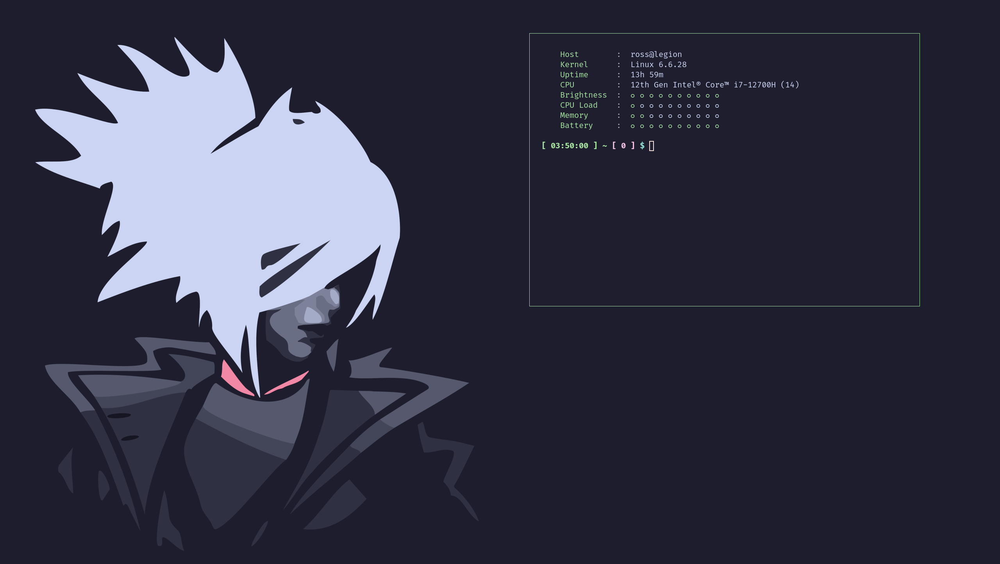

# NixOS configuration

My NixOS config.



## USAGE

```sh
echo 'use flake' > .envrc
direnv allow
nixos-rebuild switch --flake '.#%device%'
```

See `outpus.nixosConfigurations` in `flake.nix` for the list of available devices.

### UPDATE

```sh
nix flake update
npins update
```

### QUIRKS

#### THEME

- Ardour: Mocha only.
- DeaDBeeF: configure manually
- Hydrogen: configure manually
- Firefox: https://github.com/catppuccin/firefox
- Sonic Visualiser: Does not take qt6ct settings into account.
- Sublime Merge: No theme.
- Telegram:
    - https://t.me/addtheme/ctplatteimproved
    - https://t.me/addtheme/ctpfrappeimproved
    - https://t.me/addtheme/ctpmacchiatoimproved
    - https://t.me/addtheme/ctpmochaimproved
- Userstyles: https://github.com/catppuccin/userstyles
